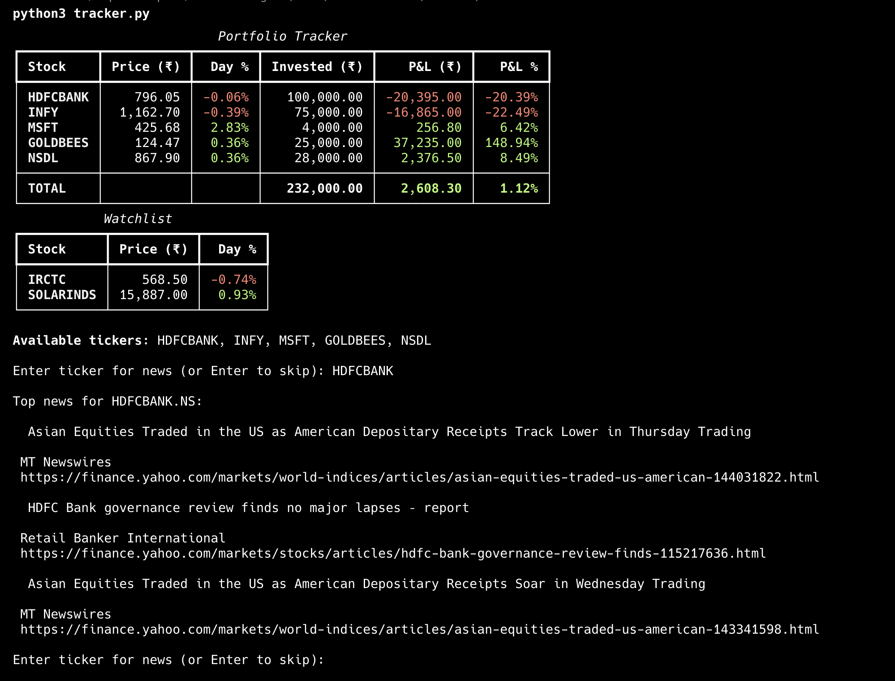

# Stock Portfolio Tracker CLI

A terminal-based portfolio tracker for Indian and US stocks.
Tracks live prices, P&L, day change, fundamentals, and on-demand news — all from the terminal.

## Preview



## Features

- Live prices via yfinance (NSE, BSE, US stocks and ETFs)
- P&L in ₹ and % per holding with totals
- Day change in ₹ and % per holding
- Stocks, ETFs, and Watchlist in separate sections
- Fundamentals — P/E, EPS, ROE, profit margin, analyst target and recommendation
- On-demand news headlines per ticker (opt-in via flag)
- Auto-refresh mode that reruns every 5 minutes
- Clean exit on Ctrl+C

## Project structure

```
stock-one/
├── main.py               ← entry point, argument parsing
├── trackers.py           ← loads portfolio, fetches prices, renders tables
├── fundamentals.py       ← fetches and displays fundamental data
├── news.py               ← interactive news prompt
├── utils.py              ← shared helpers: fetch, format, build tables
├── portfolio.json        ← your data (gitignored)
├── portfolio.json.example
├── fundamentals.json     ← cached fundamentals (gitignored)
└── requirements.txt
```

## Setup

### 1. Clone the repository

```bash
git clone https://github.com/rajeshkio/portfolio-tracker.git
cd portfolio-tracker
```

### 2. Create a virtual environment

```bash
python3 -m venv venv
source venv/bin/activate
```

### 3. Install dependencies

```bash
pip install -r requirements.txt
```

### 4. Set up your portfolio

```bash
cp portfolio.json.example portfolio.json
```

Open `portfolio.json` and fill in your actual holdings. The structure:

```json
{
    "portfolio": [
        {"ticker": "HDFCBANK.NS", "buy_price": 929.78, "qty": 138}
    ],
    "etfs": [
        {"ticker": "GOLDBEES.NS", "buy_price": 52.00, "qty": 50}
    ],
    "watchlist": [
        {"ticker": "IRCTC.NS"}
    ]
}
```

Ticker format:
- NSE stocks: `TICKER.NS` (e.g. `HDFCBANK.NS`)
- BSE stocks: `TICKER.BO` (e.g. `NSDL.BO`)
- US stocks: ticker as-is (e.g. `MSFT`)

When unsure of a ticker, search the company name on [nseindia.com](https://www.nseindia.com) and copy the exact symbol.

## Usage

### Default — show portfolio, ETFs, and watchlist

```bash
python3 main.py
```

### Auto-refresh every 5 minutes

```bash
python3 main.py -r
```

### Fetch and display fundamentals

```bash
python3 main.py -f
```

Fetches P/E, EPS, ROE, profit margins, analyst targets and recommendations for all portfolio stocks. Saves results to `fundamentals.json` so you are not hitting the API on every run.

### On-demand news

```bash
python3 main.py -n
```

Shows a prompt to enter any ticker from your portfolio. Displays the top 3 recent headlines from Yahoo Finance for that stock. Press Enter with no input to exit.

```
Available tickers: HDFCBANK, INFY, BEL, MSFT
Enter ticker for news (or Enter to skip): INFY

Top news for INFY.NS:
  Infosys Q4 results beat estimates, revenue guidance cautious
  Reuters
  https://finance.yahoo.com/...

Enter ticker for news (or Enter to skip):
```

## All flags

| Flag | Description |
|---|---|
| `python3 main.py` | Default run — prices, P&L, watchlist |
| `python3 main.py -r` | Auto-refresh every 5 minutes |
| `python3 main.py -f` | Fetch and display fundamentals |
| `python3 main.py -n` | Interactive news prompt |

## Supported exchanges

| Exchange | Suffix | Example |
|---|---|---|
| NSE India | `.NS` | `HDFCBANK.NS` |
| BSE India | `.BO` | `NSDL.BO` |
| US stocks | none | `MSFT` |
